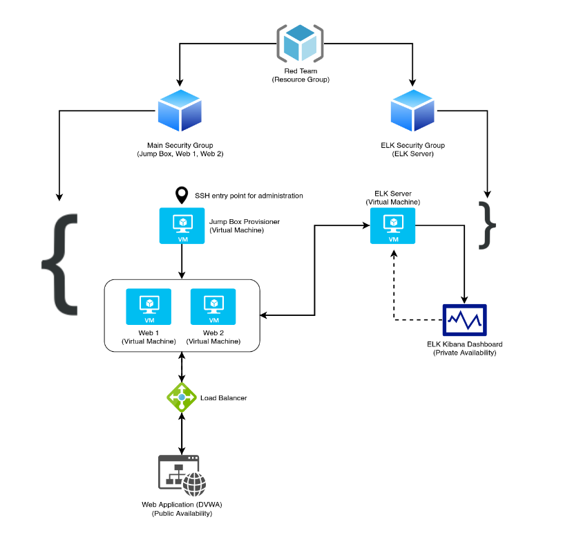
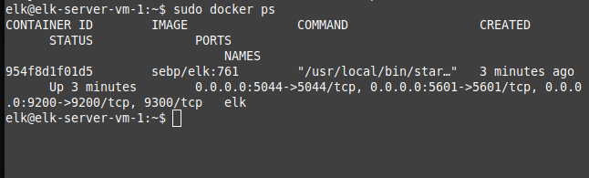

## Automated ELK Stack Deployment

The files in this repository were used to configure the network depicted below.

These files have been tested and used to generate a live ELK deployment on Azure. They can be used to either recreate the entire deployment pictured above. Alternatively, select portions of the ansible files may be used to install only certain pieces of it, such as Filebeat.

  - 

This document contains the following details:
- Description of the Topology
- Access Policies
- ELK Configuration
- Beats in Use
- Machines Being Monitored
- How to Use the Ansible Build

### Description of the Topology

The main purpose of this network is to expose a load-balanced and monitored instance of DVWA, the D*mn Vulnerable Web Application.

Load balancing ensures that the application will be accessable and responsive, in addition to restricting unwanted access to the network, as well as permitting access from certain addresses.
The jumpbox is used on the network to access nodes in many locations. This allows secure configuration protocols to be implemented, while also providing simple accessibility in development.

Integrating an ELK server allows users to easily monitor the vulnerable VMs for changes to the docker containers and system logs.
- Filebeat watches and records the system logs for the Web 1 and 2 virtual machines. These logs are vital for seeing information about the virtual machines that host the public DVWA application.
- Metricbeat watches, records, and transmits information in regards to the performance of the web applications being hosted on the Web 1 and 2 virtual machines. Metricbeat also collects and transmits information from the system and the processes that are running.

The configuration details of each machine may be found below.

|   Name   |    Function   | IP Address | Operating System |
|:--------:|:-------------:|:----------:|:----------------:|
| Jump Box | Gateway       | 10.0.0.4   | Ubuntu 18.04.1   |
| Web VM 1 | Host the DVWA | 10.0.0.5   | Ubuntu 18.04.1   |
| Web VM 2 | Host the DVWA | 10.0.0.6   | Ubuntu 18.04.1   |
| ELK VM   | ELK Server    | 10.1.0.4   | Ubuntu 18.04.4   |

### Access Policies

The machines on the internal network are not exposed to the public Internet. 

Only the Jump Box machine can accept connections from the Internet. Access to this machine is only allowed from the following IP addresses:
- Public IP of the user(s) allowed to SSH into the Jump Box VM.

Machines within the network can only be accessed through the Jump Box virtual machine.
- Web VM 1
	- Available from the Jump Box virtual machine.
- Web VM 2
	- Available from the Jump Box virtual machine.
- ELK Server VM
	- Available from Web 1 & 2 virtual machines.

Publically available domains:
- 40.88.37.103 (Damn Vulnerable Web Application)
	*** Currently only available to my public IP in order to reduce traffic ***

A summary of the access policies in place can be found in the table below.

|    Name    | Publicly Accessible |              Allowed IP Addresses            |
|:----------:|:-------------------:|:--------------------------------------------:|
| Jump Box   |          No         | SSH configured for admin user                |
| Web VM 1   |        Yes/No       | from *, port 80, to DVWA  (VM is private)    |
| Web VM 2   |        Yes/No       | from *, port 80, to DVWA  (VM is private)    |
| ELK Server |          No         | 10.0.0.5, 10.0.0.6                           |

### Elk Configuration

Ansible was used to automate configuration of the ELK machine. No configuration was performed manually, which is advantageous because...
- Configuration can be reproduced easily with ansible playbooks.
- Any issues with the configuration can be traced/fixed all within one file.
- Moving from development to production is simple.

The playbook implements the following tasks:
- Using the apt module, docker is installed and the service is started.
- 'pip' is installed and used to install the Python docker module.
- Using sysctl, virtual memory is increased.
- Using docker, the 'elk' docker container is downloaded and published to the listed ports.

The following screenshot displays the result of running `docker ps` after successfully configuring the ELK instance.

### Target Machines & Beats
This ELK server is configured to monitor the following machines:
- 10.0.0.5 (Web VM 1)
- 10.0.0.6 (Web VM 2)

We have installed the following Beats on these machines:
- Filebeat
- Metricbeat

These Beats allow us to collect the following information from each machine:
- Filebeat: This beat shows us data from the system logs of Web VM 1 and 2. You should expect to see log records pulled from '/var/log/syslog' on the virtual machines.
- Metricbeat: This beat shows us metrics of the system and the processes and applications running on Web VM 1 and 2. You might expect to see logs regarding the processes running on the virtual machines.

### Using the Playbook
In order to use the playbook, you will need to have an Ansible control node already configured. Assuming you have such a control node provisioned: 

SSH into the control node and follow the steps below:
- Copy the 'filebeat-config.yml' file to '/etc/filebeat/filebeat.yml' (or 'metricbeat-config.yml' to '/etc/metricbeat/metricbeat.yml')
- Update the 'hosts' file to include the specified hosts that the playbook applies to...
	\[webservers\]
	10.0.0.5 ansible_python_interpreter=/usr/bin/python3
	10.0.0.6 ansible_python_interpreter=/usr/bin/python3
	\[elk\]
	10.1.0.4 ansible_python_interpreter=/usr/bin/python3
- Run the playbook, and navigate to the public address of your Web VM's (including the port. In my case, 40.88.37.103:5601) to check that the installation worked as expected.

